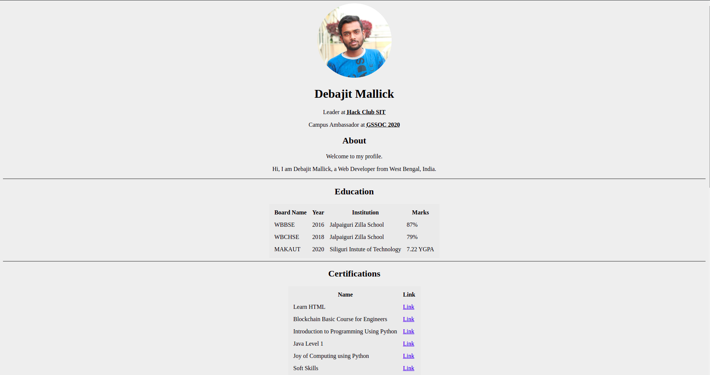

 

# Old Style Portfolio

Portfolio website created using HTML5.

## Motivation

Created this website to apply the features of HTML5 and made a website that looks like 90's.

   

## Screenshots

## Language Used

**Built with**

1. [HTML5](https://developer.mozilla.org/en-US/docs/Web/HTML)

## How to use?

If you want to visit this website just go to this [link](https://debajit13.github.io/Old-Style-Portfolio/) and then after cloning edit the code as you per your requirements.

## Want To Be a Contributor?

Read [CONTRIBUTING.md](./CONTRIBUTING.md) for contribution guidelines.

Made with :heart: and :coffee: by Debajit Mallick

